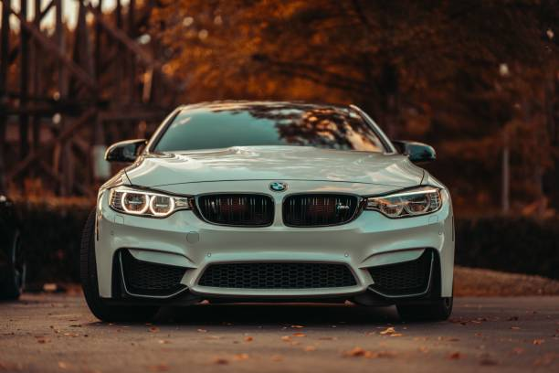

# Welcome 
## Hello Users
### A powerfully designed elite sporting icon. The most powerful BMW M4 Competition Coupé with M xDrive delivers 390 kW (530 hp) thanks to the High-Performance M TwinPower Turbo inline 6-cylinder petrol engine. The M4 Competition Coupé with M xDrive guarantees maximum driving dynamics. Both on the racetrack and in day-to-day driving.

# 🛠 Technology
 